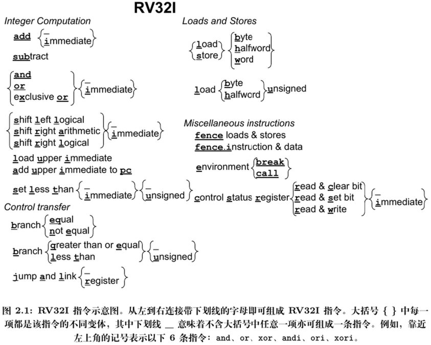
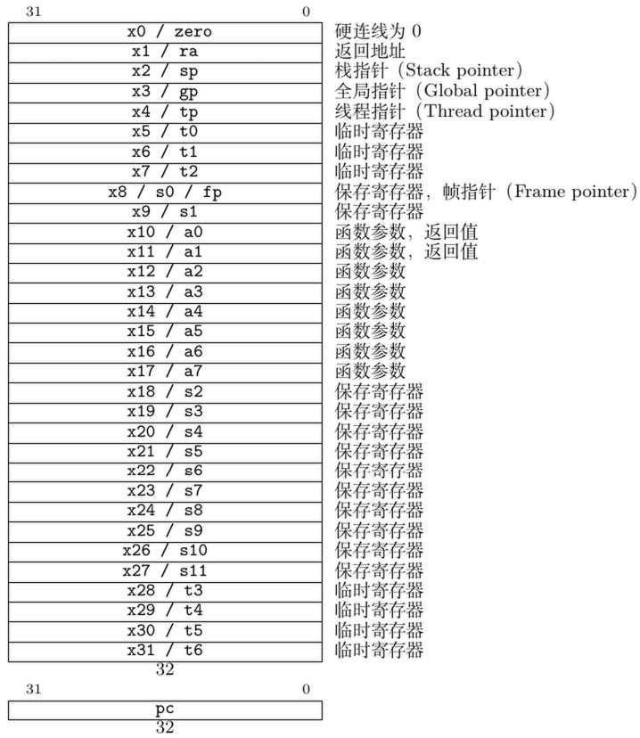
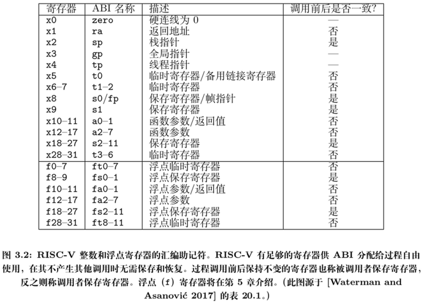

# RISC-V

> RISC-V 是模块化的，其核心是一个名为 $RV\mathcal{32}I$ 的基础 ISA，可运行完整的软件栈
>
> 一般约定将扩展对应的字母加到指令集名称之后，以指示包含哪些扩展。
>
> 我们这里使用到的是 $RV\mathcal{32}IM$

## RV32I

RISC-V 只有 6 种指令格式，且 RISC-V 指令支持 3 个寄存器操作数



RISC-V 有 31 个寄存器和恒为 0 的 x0 寄存器：



RISC-V ISA 能如此简洁的一个重要原因是，它为常量 0 专门分配了一个寄存器。

RV32I 的立即数总是进行符号扩展，因此它们也能表示负数（故 RV32I 中国无需包含立即数版本的 sub 指令）

程序中比较操作的结果是一个布尔值。为支持这种场景，RV32I 提供一条小于则置位 (set less than) 指令。

虽然 RV32I 分支指令支持两个寄存器间的所有关系运算，但条件表达式可能涉及多对寄存器间的关系，此时编译器或汇编语言程序员可将 slt 和 and, or , xor 等逻辑运算指令组合，以处理更复杂的条件表达式

访存指令 **唯一支持** 的寻址模式是将 12 位立即数符号扩展后与寄存器相加，这在 x86-32 中称为 **偏移寻址**

RV32I 的所有寻址模式均适用于所有数据类型

RISC-V 能模拟 x86 的部分寻址模式，例如，将立即数字段设为 0 即可实现寄存器间接寻址的效果。

与 x86-32 不同，RISC-V 没有专用的栈指令，通过将一个通用寄存器作为栈指针，即可使标准的寻址模式具备压栈（push）和弹栈（pop）指令的大部分优点，而无需增加 ISA 复杂性

RV32I 可比较两个寄存器，并根据比较结果是否相等（beq）、不相等（bne）、大于等于（bge）或小于（blt），决定是否跳转。后两种为有符号比较，RV32I 也提供相应的无符号版本：begu 和 bltu。剩余两种比较操作可简单通过交换操作数实现。

> 可借助一条 bltu 指令检查有符号的数组边界，因为根据无符号比较，负索引比任意非负边界值都大！
>
> RISC-V 不使用条件码实现条件分支
>
> 条件码的存在使大多数指令必须隐式设置若干额外状态，使乱序执行的依赖关系判断变得更复杂

## 调用约定

函数调用过程通常分为 6 个阶段：

1. 将参数存放到函数可访问的位置；
2. 跳转到函数入口（使用 RV32I 的 jal 指令）；
3. 获取函数所需局部存储资源，按需保存寄存器；
4. 执行函数功能；
5. 将返回值存放到调用者可访问的位置，恢复寄存器，释放局部存储资源；
6. 由于程序可从多处调用函数，故需将控制权返回到调用点（使用 ret 指令）

为提升性能，应尽量将变量存放在寄存器而不是内存中，但同时也要避免因保存和恢复寄存器而频繁访问内存。

幸运的是，RISC-V 有足够的寄存器兼顾两者：既能将操作数存放在寄存器，还能减少保存和恢复它们的次数。关键在于，一些寄存器不保证其值在函数调用前后保持一致，称为临时寄存器；另一些能保证，称为保存寄存器。

不再调用其他函数的函数称为叶子函数。当一个叶子函数只有少量参数和局部变量时，可将其分配到寄存器，无需分配到内存。

大部分函数调用均如此，此时程序无需将寄存器保存到内存



| 名称               | 寄存器      | 用途说明      | 保存责任   |
| ---------------- | -------- | --------- | ------ |
| `x0`             | `zero`   | 常量 0      | 不可修改   |
| `x1`             | `ra`     | 返回地址      | 调用者保存  |
| `x2`             | `sp`     | 栈指针       | 被调用者保存 |
| `x5–x7`          | `t0–t2`  | 临时寄存器     | 调用者保存  |
| `x28–x31`        | `t3–t6`  | 临时寄存器     | 调用者保存  |
| `x10–x17`        | `a0–a7`  | 参数/返回值寄存器 | 调用者保存  |
| `x8–x9, x18–x27` | `s0–s11` | 保存寄存器     | 被调用者保存 |

调用者保存寄存器（caller-saved registers）&& 被调用者保存寄存器（callee-saved registers）

根据 ABI 规范，函数入口和出口的标准 RV32I 代码如下：

- 函数的准备阶段（prologue）

```riscv
entry_label:
    addi sp, sp, -framesize # 调整栈指针（sp 寄存器）来分配栈帧
    sw ra, framesize-4(sp)  # 保存返回地址（ra 寄存器）
```
